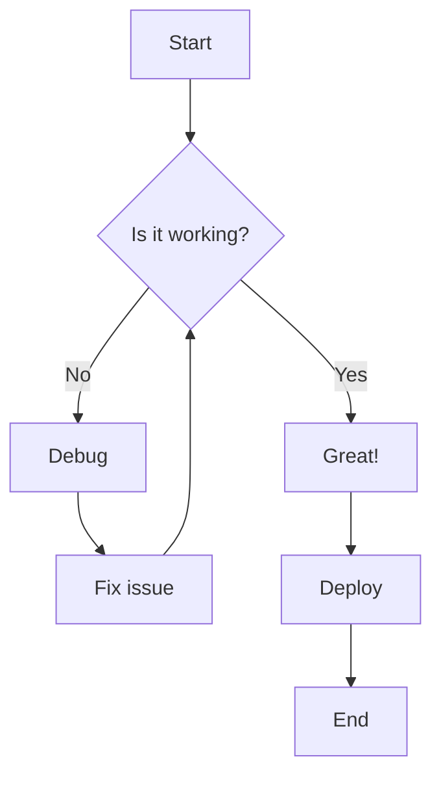
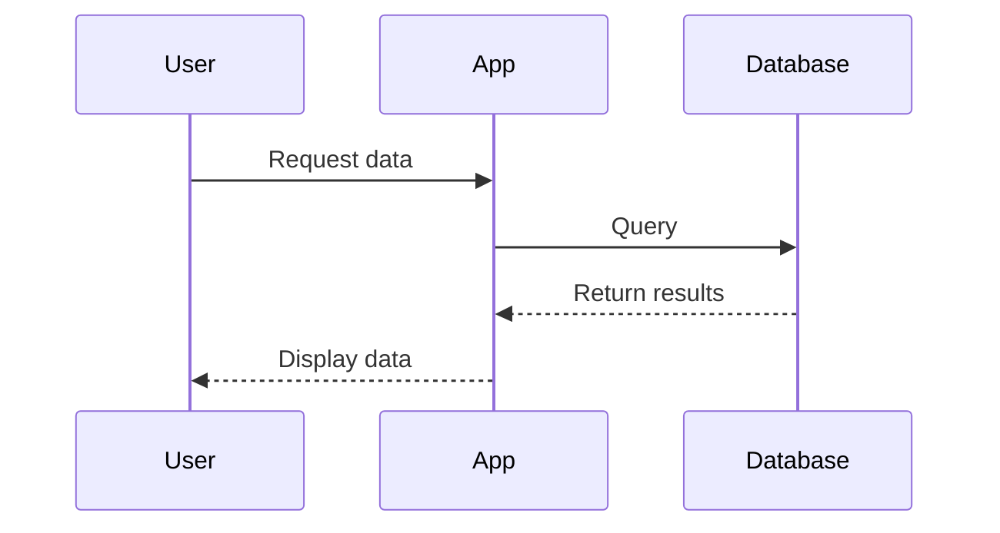
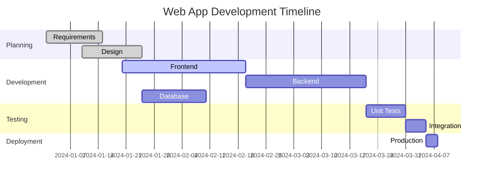
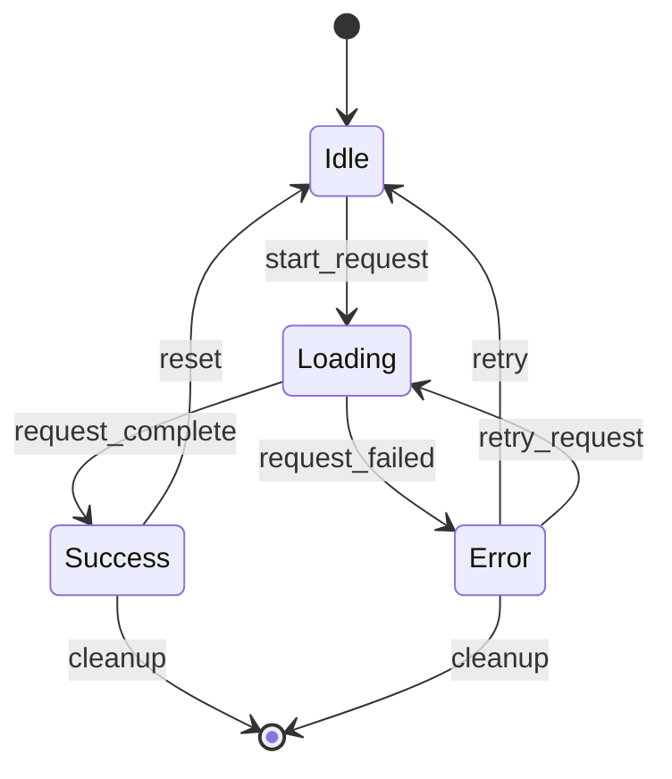
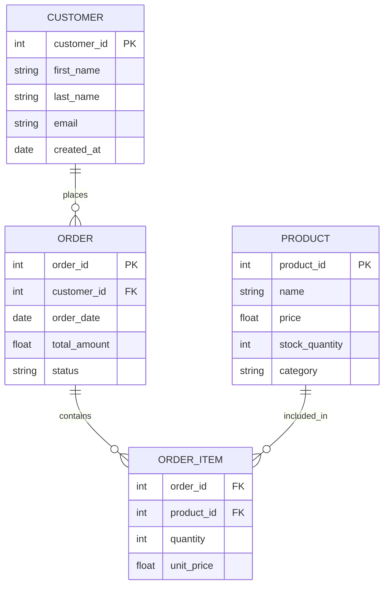
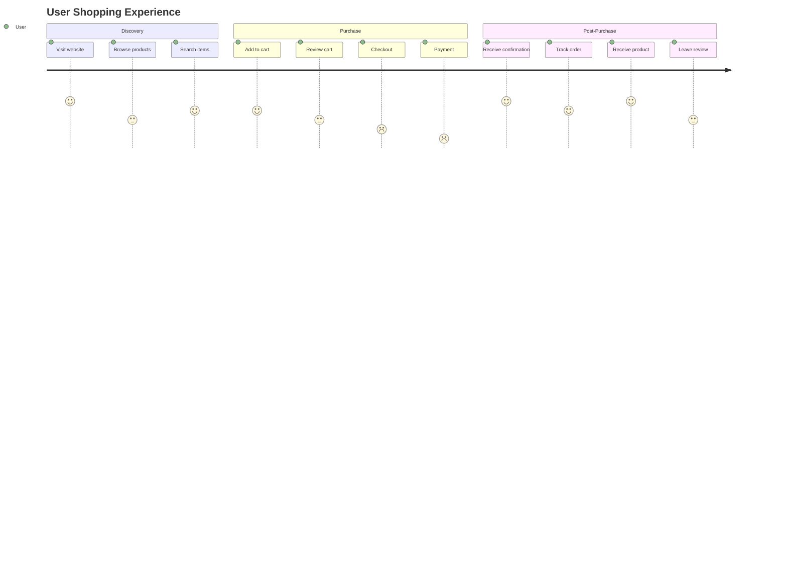

# junk
Junk

## Project Workflow



## Sequence Diagram Example




## Gantt Chart - Project timelines



## Class Diagram - Object-oriented design

```mermaid
classDiagram
    class User {
        -string email
        -string password
        -string name
        +login()
        +logout()
        +updateProfile()
    }
    
    class Order {
        -int id
        -Date createdAt
        -float total
        +calculateTotal()
        +addItem()
        +removeItem()
    }
    
    class Product {
        -int id
        -string name
        -float price
        -int stock
        +updateStock()
        +getPrice()
    }
    
    User ||--o Order : places
    Order ||--o Product : contains
```


## State Diagrams - System states and transitions




## Entity Relationship Diagrams - Database schemas




## User Journey Diagrams - User experience flows

