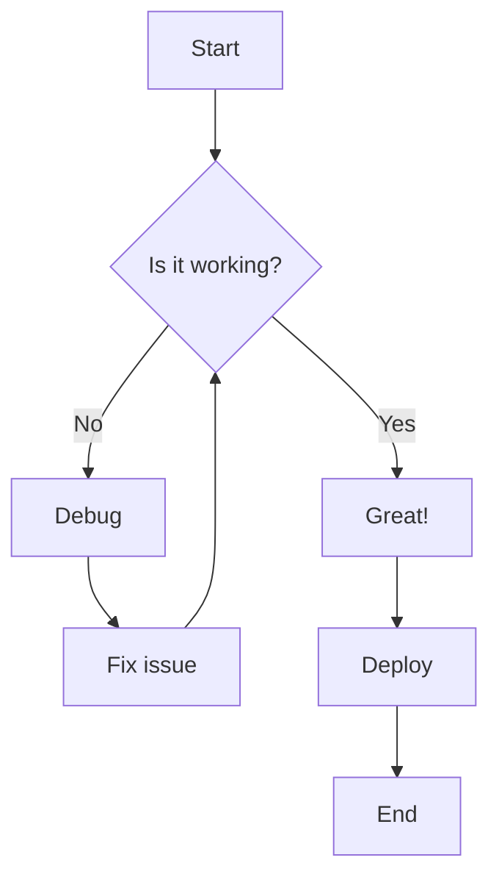
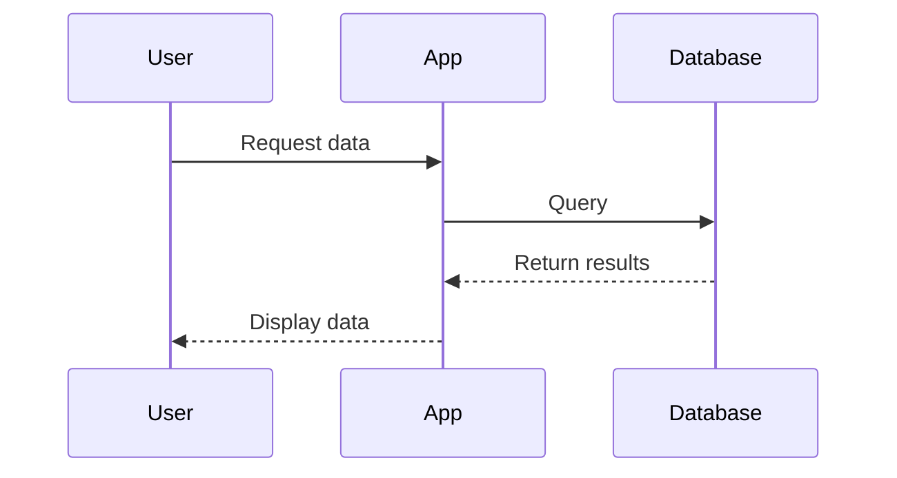
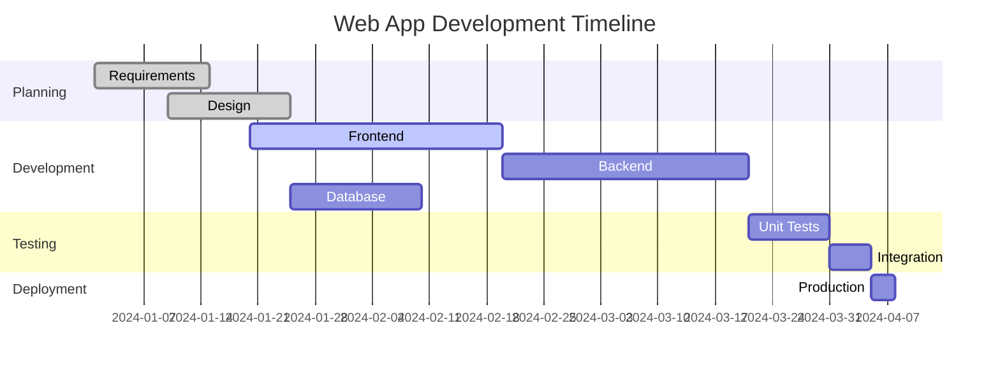

# junk
Junk

## Project Workflow

```mermaid
flowchart TD
    A[Start] --> B{Is it working?}
    B -->|Yes| C[Great!]
    B -->|No| D[Debug]
    D --> E[Fix issue]
    E --> B
    C --> F[Deploy]
    F --> G[End]
```

## Sequence Diagram Example

```mermaid
sequenceDiagram
    participant User
    participant App
    participant Database
    
    User->>App: Request data
    App->>Database: Query
    Database-->>App: Return results
    App-->>User: Display data
```

```mermaid
gantt
    title Web App Development Timeline
    dateFormat  YYYY-MM-DD
    section Planning
    Requirements    :done, req, 2024-01-01, 2024-01-15
    Design         :done, des, 2024-01-10, 2024-01-25
    section Development
    Frontend       :active, front, 2024-01-20, 2024-02-20
    Backend        :back, after front, 30d
    Database       :db, 2024-01-25, 2024-02-10
    section Testing
    Unit Tests     :test1, after back, 10d
    Integration    :test2, after test1, 5d
    section Deployment
    Production     :prod, after test2, 3d
```