# junk
Junk

## Project Workflow

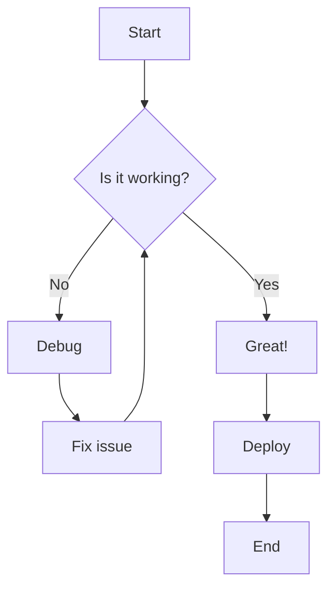

## Sequence Diagram Example

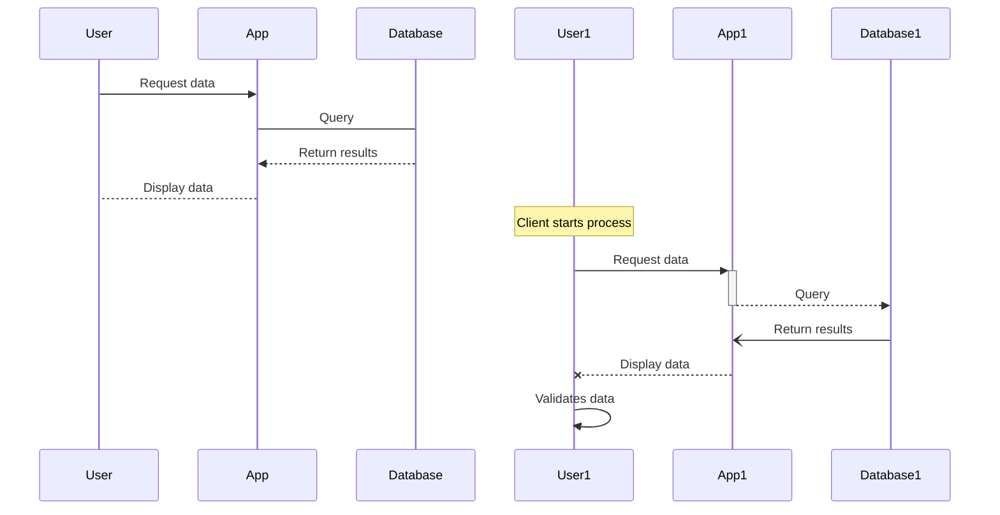


## Gantt Chart - Project timelines

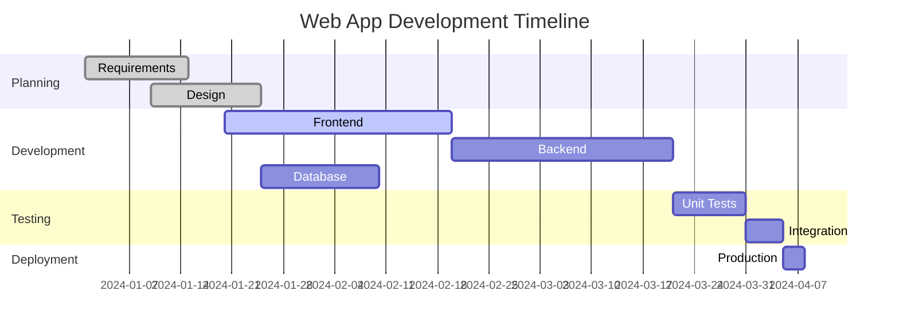

## Class Diagram - Object-oriented design

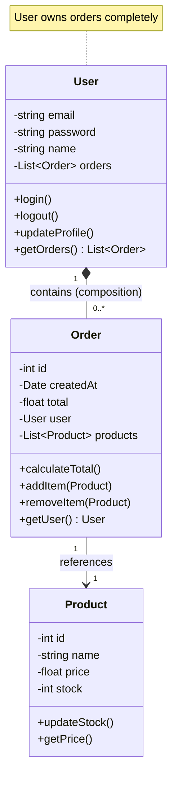

## State Diagrams - System states and transitions

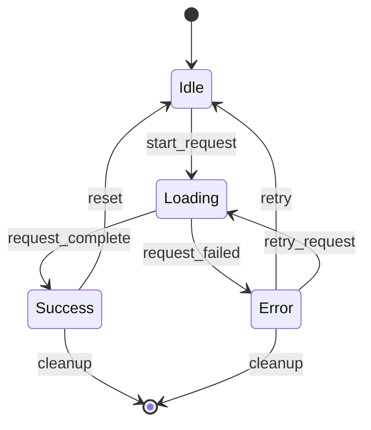


## Entity Relationship Diagrams - Database schemas


## User Journey Diagrams - User experience flows

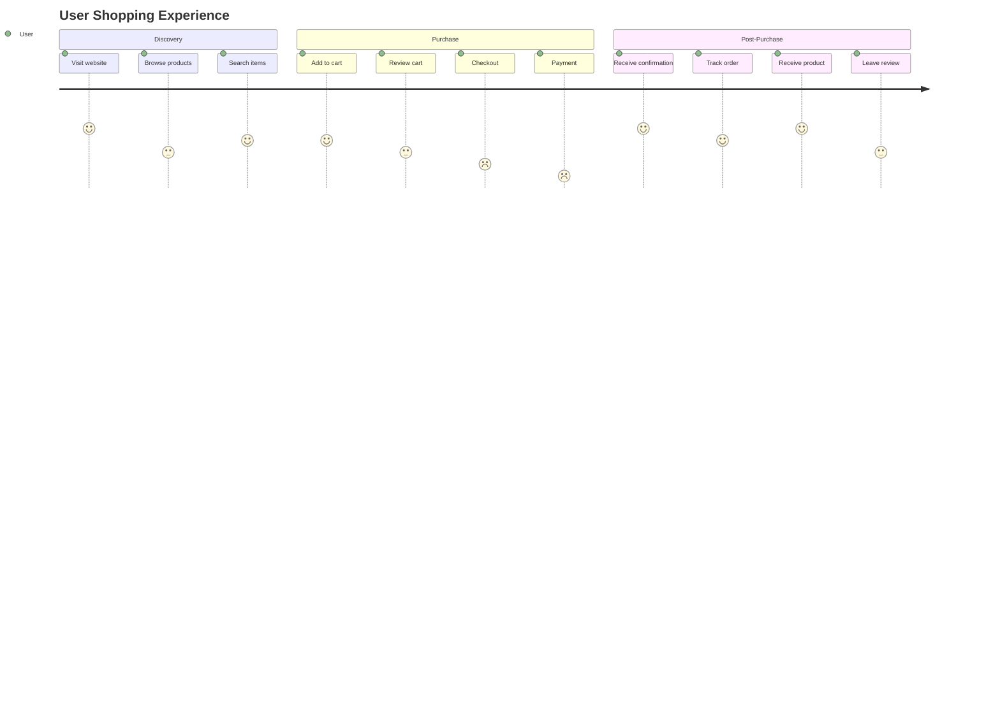

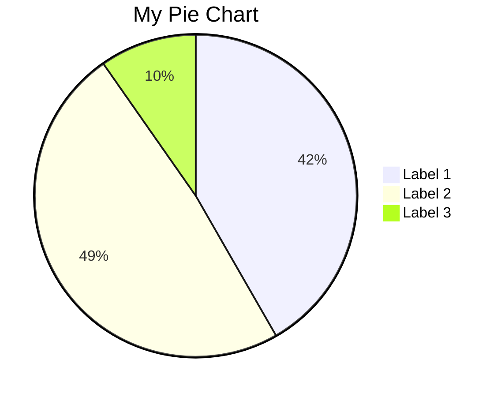

Use HTML/CSS Layout (Recommended)
<div style="display: flex; gap: 20px;">
  <div style="flex: 1;">
    <h3>Q1 Sales</h3>
    
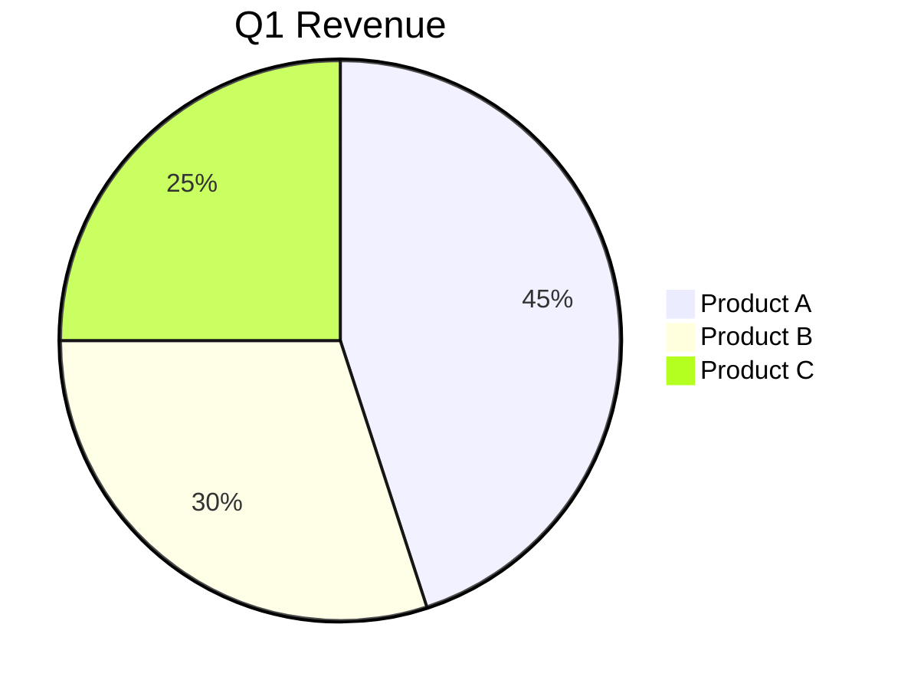
  </div>
  <div style="flex: 1;">
    <h3>Q2 Sales</h3>
    
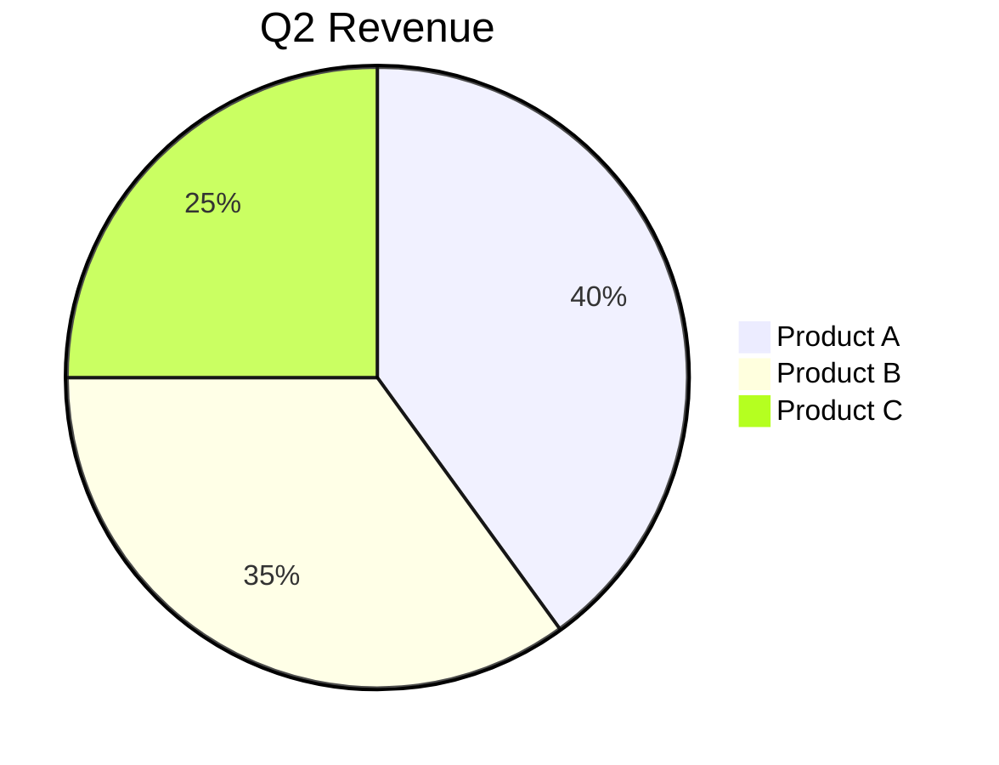
  </div>
</div>


Using markdown tables
| Q1 Performance | Q2 Performance |
|----------------|----------------|
| ```mermaid<br>pie title Q1<br>"Sales" : 60<br>"Marketing" : 40<br>``` | ```mermaid<br>pie title Q2<br>"Sales" : 70<br>"Marketing" : 30<br>``` |


Sequential Charts with Clear Separation
## Side-by-Side Comparison

### Before Implementation
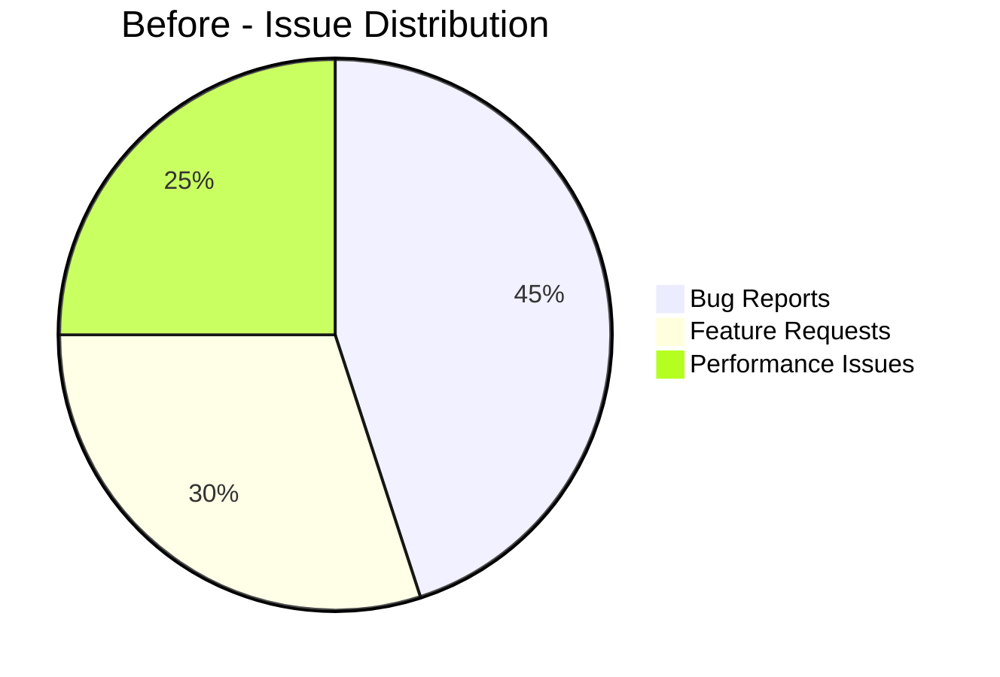

### After Implementation
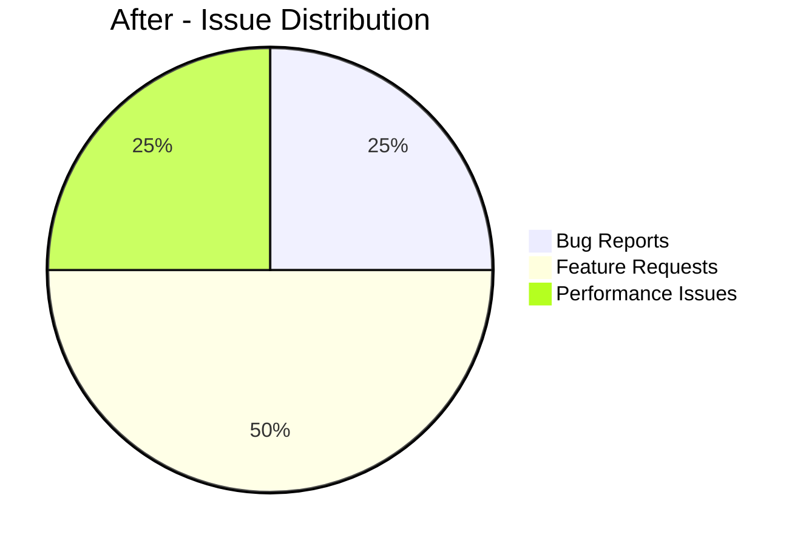


4. Use Subgraphs in Flowcharts
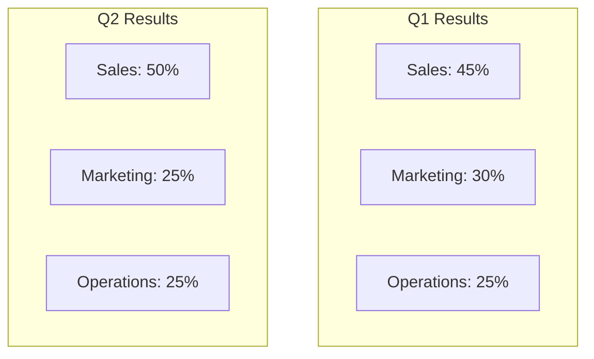